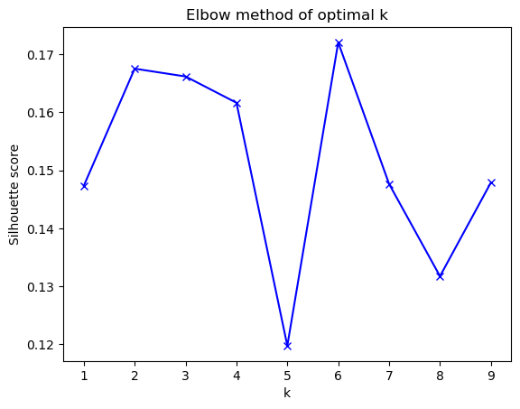

#  Capstone Project: Unsupervised Text Clustering using Natural Language Processing (NLP)

#### Author: Goh Shu Xian

## Introduction
Unsupervised learning is a type of algorithm that learns patterns from untagged data. As part of unsupervised learning, clustering is used to group similar data points without knowing which cluster the data belong to. So in a sense, text clustering is about how similar texts (or sentences) are grouped together. 

## Background
Founded in 2009, Give.asia is Asia's leading free fundraising platform for fundraisers to raise money for their causes. This social enterprise have helped more than 18,000 campaigns across APAC, raising more than SGD$100 million. After each donation made online, donors can leave a message on 'Why I gave?'.

## Problem Statement

In this project, we would explore a text dataset that comprises of 1000 comments that donors left after donating to charity campaigns on Give.asia. We hope that we can use unsupervised machine learning models to find groups of similar instances in the text data (clustering), and potentially find out the types of donors that have been generously giving. With these insights, we can potentially shape and design future donor's engagement or donor journey maps through targetted marketing strategies.

## Data Dictionary

|Data|Description|
|---|---|
|[donation_reason](./dataset/donation_reason.csv)| 1,000 rows of raw comments|
|[cleaned_comments](./dataset/cleaned_comments.csv)| 874 rows of cleaned comments|
|[cluster_0](./dataset/cluster_0.csv)| 752 rows of data extracted from cluster 0|
|[cluster_1](./dataset/cluster_1.csv)| 68 rows of data extracted from cluster 1|
|[cluster_2](./dataset/cluster_2.csv)| 54 rows of data extracted from cluster 2|

Data dictionary of the new features:

|Feature|Type|Description|
|---| ---| ---|
|text_length| int| Number of letters in each comment|
|text_wordcount| int| Number of words in each comment|
|tokenized_comment| obj|Tokenized comments after preprocessing| 
|token_lem| obj| Comments that are lemmatized|
|token_pstem|obj| Comments that are porter-stemmed|
|cleaned_lem| obj| Preprocessed comments that are lemmatized|
|cleaned_pstem| obj| Preprocessed comments that are porter-stemmed|
|cluster| int| Cluster group via KMeans with TFIDF|
|x0| int| Vector point, x0|
|x1| int| Vector point, x1|
|cluster1| int| Cluster group via KMeans with CountVectorizer|
|x0_1| int| Vector point, x0_1|
|x1_1| int| Vector point, x1_1|

## Preprocessing
1. Language Detection
2. Removal of non english rows 
3. Removal of special characters and white spaces
4. Tokenizing 
5. Lemmatizing

## Executive Summary

Text themselves cannot be used by machine learning models. They expect their input to be numeric. So we need some way that can transform their input to be numeric. In this project we have coupled CountVectorizer with various clustering algorithm to perform text clustering on our cleaned lemmatized dataset. 

The following clustering algorithms were tested in this project, namely:
1. KMeans 
2. DBSCAN
3. Affinity Propagation

### Evaluation Metrics
Evaluating the performance of a clustering algorithm is not as trival as counting the number of errors or precision and recall like in the case of supervised learning algorithms. Validating the clustering algorithm is tricky and an evaluation metrics have been derived based on the following: 

- Number of optimal clusters, k (using The Elbow Method)
- Silhouette Coefficient
- Interpretability of clusters 

### Model Selection & Performance

We have selected KMeans clustering algorithm, with k = 3 as our preferred model. The silhouette coefficient is 0.1676. The best value is 1 and the worst value is -1. Values near 0 indicate overlapping clusters. Do note that a high score does not necessarily indicate good clustering. Instead, it measures at best the difference between the metric and what our clustering algorithm opitmized for.

### Data Abstraction

From the 3 clusters that we have observed from KMeans clustering algorithm, we can distinctly identify 3 unique features within their clusters.

For the first cluster, we can infer from the comments that this group of donors uphold their respective religious belief, and donate because of their faith. Key words like 'God', 'God Bless', 'Allah' are the main reasons that they are grouped together. This is the smallest cluster as compared to the other two, takes up 6% of the total comments.

For the second cluster, we call them the 'Get well soon' club. The key words generated from their comments were straightforward -'Get Well Soon'. Although there are overlapping key words such as 'God bless', the main message that these comments were driving across was really simplistic and objective/ goal driven. They are also a relatively small group, close to 8% of the total comments.

The third cluster, which is the largest one, takes up 88% of the total comments. Main motivation for giving in this particular group resonates strongly with altruism - concern or compassion for those less fortunate. There's a range of key words within this cluster that amplifies the notion of giving such as 'need', 'want', 'life', 'support', 'help'. Also, we can see more citations of personal experiences within this cluster.

### Final Evaluation

The clustering algorithm managed to filter out two minority groups that were distinct in characteristics. The percentage of comments coming from these two particular groups may not be a good representation of the demographics of the donors for GiveAsia, but their unique features can potentially be a great help in designing and customising donors' engagement or journey map. 

The biggest cluster in our study can be further broken down into smaller clusters. With more advanced NLP techniques, such as BERT (Bidirectional Encoder Representations from Transformers) that can understand the context of the sentences, the contextual model can help to improve proper language representation for general-purpose language understanding by machines. This can potentially help us grasp key motivators within the scope of altruism, and improve on marketing efforts to increase outreach and donations. 

Much like any data analysis, segmentation is an iterative process with many variations of data, methods, number of clusters, and profiles generated until a satisfying solution is reached. To start with, the dataset is very simplistic with no other key features identifying the demographics of givers. If we are able to combine more personal information regarding our donors, or even more information on the campaigns they donated to the dataset, we could draw more powerful insights and create marketing strategies unique to the donors.